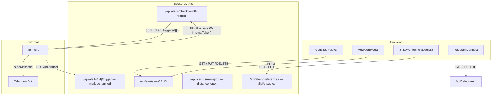
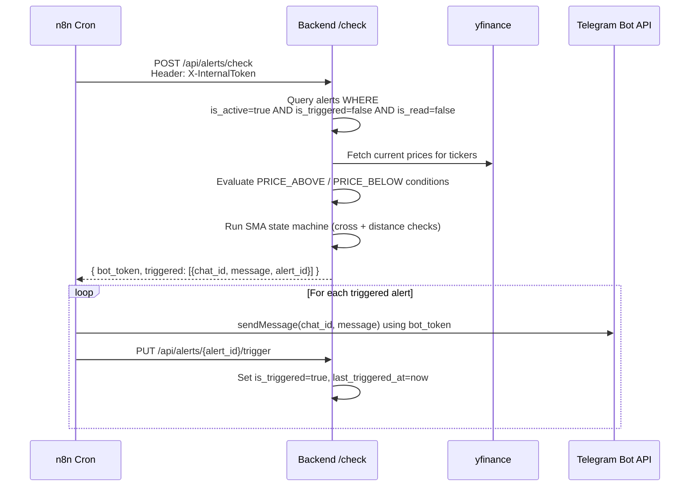

# Alerts & Notifications System

## Architecture Overview



---

## Database Tables

### `alerts` table

| Column | Type | Default | Description |
|--------|------|---------|-------------|
| `id` | Integer PK | auto | Unique alert ID |
| `user_id` | FK → users.id | required | Owner |
| `company_id` | FK → companies | nullable | Linked company (optional) |
| `ticker` | String | required | Ticker symbol (denormalized for display) |
| `alert_type` | Enum(AlertType) | required | See AlertType table below |
| `threshold_value` | Float | required | Target price, %, or SMA value |
| `is_active` | Boolean | `true` | Whether alert is live |
| `is_triggered` | Boolean | `false` | Set `true` once condition was met & notification sent |
| `last_triggered_at` | DateTime | null | Timestamp of last trigger |
| `is_read` | Boolean | `false` | User dismissed/acknowledged it in UI |
| `snoozed_until` | DateTime | null | Suppresses display until this time |
| `message` | String | null | Custom note (manual) or auto-generated text (SMA) |
| `created_at` | DateTime | utcnow | |
| `updated_at` | DateTime | auto | |

### `user_alert_preferences` table

Stores per-user **SMA monitoring toggles** — applies to ALL holdings + watchlist tickers.

| Column | Type | Default | Description |
|--------|------|---------|-------------|
| `user_id` | FK → users.id | unique | One row per user |
| `sma50_cross_above` | Boolean | false | Notify when price crosses above SMA 50 |
| `sma50_cross_below` | Boolean | false | Notify when price drops below SMA 50 |
| `sma200_cross_above` | Boolean | false | Notify when price crosses above SMA 200 |
| `sma200_cross_below` | Boolean | false | Notify when price drops below SMA 200 |
| `sma50_distance_25` | Boolean | false | Notify when price ≥25% from SMA 50 |
| `sma50_distance_50` | Boolean | false | Notify when price ≥50% from SMA 50 |
| `sma200_distance_25` | Boolean | false | Notify when price ≥25% from SMA 200 |
| `sma200_distance_50` | Boolean | false | Notify when price ≥50% from SMA 200 |
| `last_sma_alerts_sent` | Text (JSON) | `"{}"` | **State machine** — tracks previous state per ticker to detect transitions |

---

## AlertType Enum — All 12 Values

### Manual (user-created via AddAlertModal)

| AlertType | UI Label | Threshold meaning | Evaluation |
|-----------|----------|-------------------|------------|
| `PRICE_ABOVE` | Price Goes Above | Target price | `current_price >= threshold` |
| `PRICE_BELOW` | Price Goes Below | Target price | `current_price <= threshold` |
| `PERCENT_CHANGE_UP` | % Move Up | Percentage | ⚠️ **Not implemented** in backend |
| `PERCENT_CHANGE_DOWN` | % Move Down | Percentage | ⚠️ **Not implemented** in backend |
| `SMA_50_ABOVE_SMA_200` | Golden Cross | 0 (auto) | ⚠️ **Not implemented** in backend |
| `SMA_50_BELOW_SMA_200` | Death Cross | 0 (auto) | ⚠️ **Not implemented** in backend |
| `SMA_50_APPROACHING_SMA_200` | SMA Approaching | Within X% | ⚠️ **Not implemented** in backend |

> **Warning:** Only `PRICE_ABOVE` and `PRICE_BELOW` actually trigger Telegram notifications. The other 5 manual types have UI code but return `False, ""` from `_evaluate_alert()` in `alert_checker.py`.

### Auto-generated (created by SMA monitoring engine)

These are **never created manually** — the backend creates them automatically when an SMA condition changes.

| AlertType | Meaning | Created when |
|-----------|---------|--------------|
| `SMA_50_CROSS_ABOVE` | Price crossed above SMA 50 | State changes from "below" to "above" |
| `SMA_50_CROSS_BELOW` | Price dropped below SMA 50 | State changes from "above" to "below" |
| `SMA_200_CROSS_ABOVE` | Price crossed above SMA 200 | Same logic for SMA 200 |
| `SMA_200_CROSS_BELOW` | Price dropped below SMA 200 | Same logic for SMA 200 |
| `SMA_50_DISTANCE` | Price ≥ 25 or 50% from SMA 50 | Threshold stores 25 or 50 |
| `SMA_200_DISTANCE` | Price ≥ 25 or 50% from SMA 200 | Threshold stores 25 or 50 |

---

## Backend API Endpoints

### 1. CRUD — `/api/alerts` (auth: Bearer token)

| Method | Path | Description |
|--------|------|-------------|
| `GET /api/alerts` | | Get all alerts for current user |
| `POST /api/alerts` | body: `AlertCreate` | Create a manual alert |
| `PUT /api/alerts/{id}` | body: `AlertUpdate` | Update (mark read, snooze, etc.) |
| `DELETE /api/alerts/{id}` | | Delete single alert |
| `DELETE /api/alerts` | | Delete ALL user alerts |

Source: `backend/api/alerts.py`

### 2. n8n Alert Checker — `/api/alerts` (auth: `X-InternalToken` header)

| Method | Path | Description |
|--------|------|-------------|
| `POST /api/alerts/check` | | Evaluate all alerts, return triggered list |
| `PUT /api/alerts/{id}/trigger` | | Mark single alert as triggered (called by n8n after Telegram send) |
| `POST /api/alerts/sma-report` | | Generate SMA distance report for Telegram |

Source: `backend/api/alert_checker.py`

### 3. Alert Preferences — `/api/alert-preferences` (auth: Bearer token)

| Method | Path | Description |
|--------|------|-------------|
| `GET /api/alert-preferences/` | | Get user's SMA toggle preferences |
| `PUT /api/alert-preferences/` | body: partial | Update toggles (partial update) |

Source: `backend/api/alert_preferences.py`

---

## X-InternalToken Authentication

A **shared secret** between n8n and the backend for machine-to-machine calls. Not related to user JWT tokens.

- Set in `backend/.env`: `INTERNAL_API_TOKEN=changeme`
- Loaded via `core/config.py` → `settings.INTERNAL_API_TOKEN`
- n8n must send HTTP header: `X-InternalToken: <value>`
- If missing or wrong → **403 Forbidden**

Used by: `/api/alerts/check`, `/api/alerts/{id}/trigger`, `/api/alerts/sma-report`

---

## n8n → Telegram Notification Flow



### Key behaviors

- **Manual alerts (PRICE_ABOVE/BELOW):** One-shot — once `is_triggered=true`, they never fire again
- **If n8n doesn't call PUT `/trigger`:** The alert stays `is_triggered=false` and fires again next cron cycle (becomes "repeating")
- **SMA auto-alerts:** Created with `is_triggered=true` immediately, so the PUT `/trigger` call from n8n is optional for these

---

## SMA State Machine

The `_check_sma_alerts()` function uses **state transition detection**, not absolute checks.

### State storage

JSON in `user_alert_preferences.last_sma_alerts_sent`:
```json
{
    "TSLA_sma50": "below",
    "TSLA_sma200": "above",
    "ASML.AS_25pct_sma50": true,
    "GRAB_50pct_sma200": false
}
```

### Cross alerts flow

1. Look up `CompanyMarketData.current_price` and `sma_50` / `sma_200` for each ticker
2. Calculate `current_side` = "above" or "below"
3. Compare with `prev_side` from state JSON
4. **Only fires when side CHANGES** (e.g. "above" → "below")
5. Creates a new `Alert` row (already `is_triggered=true`)
6. Auto-closes any opposite alert (e.g. closes `SMA_50_CROSS_ABOVE` when `CROSS_BELOW` fires)

### Distance alerts flow

1. Calculate `pct = abs((price - sma) / sma) * 100`
2. Check if `pct >= threshold` (25% or 50%)
3. Compare with previous boolean state from JSON
4. Fires only when transitioning **into** the threshold zone (`false → true`)
5. When dropping **out** (`true → false`), auto-closes the distance alert

### Which tickers are monitored

All `company_id`s from:
- User's portfolio BUY transactions (holdings)
- User's watchlist (FavoriteStock)

---

## Frontend UI Components

### AlertsTab — `frontend/src/features/portfolio-management/tabs/alerts/AlertsTab.tsx`

Main table with columns:

| Column | Component | What it shows |
|--------|-----------|---------------|
| Status | `AlertStatusBadge.tsx` | Triggered / Pending / Snoozed / Read badge |
| Asset | `AlertAssetCell.tsx` | Company name + ticker (clickable → stock details) |
| Current Value | `AlertValueCell.tsx` | Current price, or SMA 50/200 values for SMA comparison alerts |
| Condition | `AlertConditionCell.tsx` | Alert type label + threshold + "AUTO" badge for SMA alerts |
| Info | `AlertInfoCell.tsx` | CONDITION MET / READ / SNOOZED / PENDING badge + message + date |
| Actions | `AlertRowActions.tsx` | Mark read ✓ / Snooze 🕐 / Delete 🗑️ |

### Status determination (frontend-side)

The frontend **re-evaluates conditions live** using prices from holdings/watchlist:

```
1. If snoozed_until > now → "snoozed"
2. If is_read = true → "read"
3. If live condition met OR is_triggered = true → "triggered"
4. Otherwise → "pending"
```

### Row styling

| State | Background | Left border |
|-------|-----------|-------------|
| Triggered | Light red `#fef2f2` | Red `#ef4444` |
| Pending | Light blue `#eff6ff` | Blue `#60a5fa` |
| Snoozed | Gray `#f9fafb` | Transparent, 70% opacity |
| Read | White | Transparent |

### Row actions

| Action | Effect |
|--------|--------|
| **Mark as Read** ✓ | `PUT /api/alerts/{id}` → `{ is_read: true }` |
| **Snooze 24h** 🕐 | `PUT /api/alerts/{id}` → `{ snoozed_until: +24h }` |
| **Unsnooze** 🕐 | `PUT /api/alerts/{id}` → `{ snoozed_until: null }` |
| **Delete** 🗑️ | `DELETE /api/alerts/{id}` |
| **Clear All** | `DELETE /api/alerts` (all user alerts) |

### AddAlertModal — `frontend/src/features/portfolio-management/modals/add-alert/AddAlertModal.tsx`

Creates manual alerts. Fields:
- **Ticker** — text input (pre-filled if opened from stock context)
- **Condition** — dropdown with 7 types (Price Above/Below, % Up/Down, Golden/Death Cross, Approaching)
- **Value** — number input (hidden for Golden/Death Cross)
- **Note** — optional custom message

### SmaMonitoring — `frontend/src/features/portfolio-management/tabs/alerts/parts/SmaMonitoring.tsx`

Collapsible card with 8 toggle switches in 2 groups (SMA 50 and SMA 200). Each toggle calls `PUT /api/alert-preferences/` with optimistic UI.

### TelegramConnect — `frontend/src/features/portfolio-management/tabs/alerts/parts/TelegramConnect.tsx`

Card at top of Alerts tab:
- **Not connected:** "Connect Telegram" → opens bot link, polls `/telegram/status` every 3s
- **Connected:** Shows Chat ID + "Disconnect" button

---

## SMA Distance Report (`/api/alerts/sma-report`)

Generates formatted Telegram report grouping tickers by distance from SMA 50 and SMA 200.

| Band | Emoji | Range |
|------|-------|-------|
| Near SMA | 🎯 | ±5% |
| 5–10% above | 🟢 | +5% to +10% |
| 10–17.5% above | 🟩 | +10% to +17.5% |
| 17.5–25% above | 💚 | +17.5% to +25% |
| 25%+ above | 🚀 | >25% |
| 5–10% below | 🔴 | −5% to −10% |
| 10–17.5% below | 🟥 | −10% to −17.5% |
| 17.5–25% below | ❤️ | −17.5% to −25% |
| 25%+ below | 💀 | <−25% |

Splits messages at 4000 chars (Telegram limit). Uses HTML `<pre>` formatting.

---

## File Map

```
backend/
├── database/
│   ├── alert.py                    # Alert model + AlertType enum
│   └── user_alert_preferences.py   # SMA preferences model
├── api/
│   ├── alerts.py                   # CRUD endpoints (user auth)
│   ├── alert_checker.py            # n8n endpoints (internal token auth)
│   └── alert_preferences.py        # SMA preferences endpoints (user auth)
└── schemas/
    └── alert_schemas.py            # Pydantic request/response schemas

frontend/src/features/portfolio-management/
├── types/
│   └── alert.types.ts              # AlertType enum + Alert interface
├── modals/add-alert/
│   └── AddAlertModal.tsx           # Create manual alert dialog
└── tabs/alerts/
    ├── AlertsTab.tsx               # Main alerts table
    └── parts/
        ├── AlertUtils.ts           # AlertRow type + formatters
        ├── AlertStatusBadge.tsx     # Triggered/Pending/Snoozed/Read badge
        ├── AlertAssetCell.tsx       # Company name + ticker link
        ├── AlertValueCell.tsx       # Current price or SMA values
        ├── AlertConditionCell.tsx   # Alert type + threshold + AUTO badge
        ├── AlertInfoCell.tsx        # Condition badges + message + date
        ├── AlertRowActions.tsx      # Mark read / Snooze / Delete buttons
        ├── SmaMonitoring.tsx        # SMA toggle preferences card
        └── TelegramConnect.tsx      # Telegram pairing card
```
